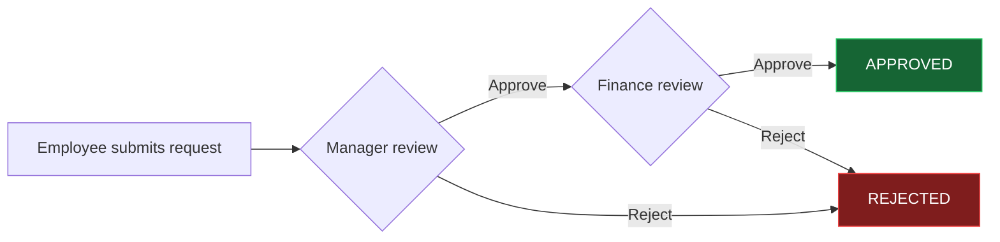

### Java & Spring Boot Developer · Full-Stack Applications · AI-Powered Projects

 

I'm a **Computer Science undergraduate at RKGIT** focused on **Java, Spring Boot, SQL, and backend development**, while also building full-stack and AI-powered applications.

My projects range from an **enterprise-style purchase approval workflow** and an **AI-powered timetable generator** to a **client website** and an **Android attendance system**. I also have hands-on database experience from my internship at **Tectura Infotech** and have solved **100+ DSA problems on coding platforms**.

🎓 B.Tech in Computer Science & Engineering · **2023–2027**
📍 Ghaziabad, Uttar Pradesh
💼 Technical Intern · **Tectura Infotech**

 

## 🛠️ Tech Stack

### Core

### Backend

### Frontend

### AI

### Tools

 

## 🚀 Featured Projects

### 🏢 [Purchase Approval Workflow System](https://github.com/shubhb072-ui/purchase-approval-system)

A full-stack enterprise-style workflow system for managing purchase requests through **Employee → Manager → Finance** approval stages.

Built with **Java 21, Spring Boot 4, Spring Security, JWT, Spring Data JPA, MySQL, HTML, CSS, and JavaScript**, with Docker support and isolated testing using H2.

**Highlights**

* JWT authentication and role-based access control
* Multi-level approval workflow
* Purchase request tracking
* Approval history and audit trail
* REST APIs and dashboards
* Dockerized deployment
* Spring Boot Actuator health checks
* H2-backed isolated tests

 

### 🤖 [AI-Powered Timetable Generator](https://github.com/shubhb072-ui/AI-Powered-Timetable-Generator)

An AI-powered college timetable scheduler using **Google Gemini 2.5 Flash** to resolve scheduling conflicts and optimize teacher, course, and classroom slots.

The interface is built with **React, Vite, and TypeScript**.

 

### 🏸 [AI-Assisted Client Badminton Website](https://github.com/shubhb072-ui/ai-assisted-client-badminton-website)

A modern badminton coaching website created for a **real client**.

The concept, page structure, visual direction, and UI/UX ideas were developed by me, while AI tools assisted with the frontend implementation.

Built with **React, Vite, JavaScript, CSS, and Framer Motion**.

 

### 📍 [Geofenced Biometric Attendance System](https://github.com/shubhb072-ui/Geofenced-Biometric-Attendance-System)

An Android attendance system combining **GPS geofencing** and **biometric authentication** to verify users within authorized campus boundaries and help prevent proxy attendance.

Built using **Android Studio, XML, and Android Location APIs**.

 

## 💼 Experience

### Technical Intern — Tectura Infotech

**June 2026 – July 2026**

Worked with relational database operations and SQL, including:

* Data retrieval, manipulation, and validation
* CRUD operations
* Query validation
* Database testing and debugging
* Data-level error checking

 

## 🧠 Problem Solving & Leadership

* **100+ DSA problems solved** on coding platforms
* **Documentation Head — IEEE Student Branch, RKGIT**, coordinating technical events and student activities
* Participated in technical workshops, hackathons, and coding events through Ducat, Coding Ninjas, Unstop, and GeeksforGeeks

 

## 🎓 Education

**B.Tech, Computer Science & Engineering**
Raj Kumar Goel Institute of Technology (RKGIT), Ghaziabad
**2023 – 2027** · Aggregate: **73.15%**

 

## 📚 Certifications & Learning

| Issuer                   | Credential                                                     |
| ------------------------ | -------------------------------------------------------------- |
| Oracle                   | Cloud Infrastructure 2025 – Certified AI Foundations Associate |
| JPMorgan Chase · Forage  | Software Engineering                                           |
| Walmart USA · Forage     | Advanced Software Engineering                                  |
| AWS APAC · Forage        | Solutions Architecture                                         |
| NPTEL                    | Data Science For Engineers                                     |
| NPTEL                    | Programming DSA Using Python                                   |
| NPTEL                    | Data Analytics with Python                                     |
| NVIDIA                   | Getting Started with AI                                        |
| Cisco Networking Academy | Introduction to Data Science                                   |
| IBM · Coursera           | Python for Data Science, AI                                    |
| Anthropic                | Claude Code in Action                                          |
| Anthropic                | Introduction to Claude Cowork                                  |

View additional certifications, memberships, workshops & events

 

### IEEE

* IEEE Day Celebration Participation Certificate
* IEEE Membership Certificate 2025–26
* IEEE Women in Engineering Membership Certificate 2025–26

### Forage

* Deloitte Australia — Cyber
* Goldman Sachs — Operations
* Tata — Cybersecurity Analyst
* Deloitte Australia — Data Analytics
* Tata — Data Visualisation: Empowering Business with Effective Insights
* Tata — GenAI Powered Data Analytics

### NPTEL

* Developing Soft Skills and Personality
* Enhancing Soft Skills and Personality

### Ducat

* 2 Days Workshop on Data Structures using C
* 1 Day Industrial Visit on Generative AI

### Unstop / GeeksforGeeks Campus Body

* Tech Talks Participation
* Quiz Arena Participation

### Coding Ninjas

* Participation in Binary Codes 2.0

### Futurista

* Certificate for Qualifying Round 1 in BrawlBits Event

### HP

* AI for Beginners

 

## 📊 GitHub Activity

  
  

 

## 📫 Connect

  

**Open to Software Development, Java Backend, and Full-Stack opportunities.**

